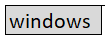
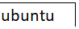

# PingFed Automation Setup steps
## Prerequisites 
- Java JDK 17  
- JAVA_HOME environment variable should be correctly setup.
- Java,  Path environment variable.   
- A running mysql with root user credentials to enable creation of a user,  schema and tables in the mysql for use by pingfederate.  
- Ensure ports 9999, 9031, 8080, 8081 are available and not in use before proceeding.  
- Internet access  
- Should be able to launch gradlew(.bat) included in the project. 


## The steps

[](Setup-win.md)[](Setup-ubuntu.md) 

Clone the project from - here to a suitable folder in your machine.  
git clone -b main https://github.com/teq-niq/pingfed-automation.git  
Read pingfed-automation\downloads\downloadnotes.txt.   
<ins>Download the files as mentioned here into **"pingfed-automation\downloads"** folder.</ins>    
In command prompt/terminal navigate to pingfed-automation folder.   
**For convenience We will run all our commands from this location only.**  
On linux do this first.
Run sudo chmod +x ./gradlew 
Run ".\gradlew clean build" in command prompt or "./gradlew clean build" in linux terminal.  
This might take some time on first run.  
  
Wait for it to finish successfully.  
    

Run ".\gradlew verify-downloads".  
I got this output.  
   
 

```diff
! Impotant Note: Before proceeding ensure that mysql is running and reachable.  
! pingfed-automation/mysql.properties file entries should match the expectations.  
+ Edit pingfed-automation\mysql.properties as needed.  
```
**Impotant Note:**
*Before proceeding ensure that mysql is running and reachable.   
pingfed-automation/mysql.properties file entries should match the expectations.  
Edit pingfed-automation\mysql.properties as needed.*   

Run “.\gradlew ping-setup”. 
leaving below lines for now. must remove.    
<ins>On linux might need to use  “sudo ant”.</ins>   
In linux sometimes sudo ant will report "sudo: ant: command not found".
If so please add below line in your .bashrc and source it.  
- alias sudo='sudo env PATH=$PATH $@'   
After adding above line run below.    
- source ~/.bashrc
   
    

Result should look like this:   
  

   
 
That should setup pinfederate.
#### Start PingDirectory
Run ".\gradlew ping-start-ds".     
  
Result should look like this:  
  
Note: 
PingDirectory can also be started by launching: start-server.bat or start-server.sh found in bin/bat folder of the Ping Directory.
#### Start Ping Federate
Run “.\gradlew ping-start-pingfed”.      
  
Result should look like this:  
  
Note: Just starting the Ping Federate. Also capturing the process id in case of windows.  
Ping Federate can also be started by launching: run.bat or run.sh found in bin folder of the Ping Federate.  
#### Use Ping Federate Admin Console first time
I am using chrome browser. Should possibly work well in other browsers too.  
Visit https://localhost:9999/  
   
You might get a message "Your connection is not private" as shown above.
If so press Advanced button   
   
Click on the proceed to localhost link.  
Note: Its possible to configure SSL better. Not covering that here.  
We should be seeing this.  
   
Check the checkbox and press Next button.  
   
I left the base url at "https://localhost:9031" for now. It can be modified later too. Press Next.  
   
Do nothing. Just press Next.  For now avoid the check box encouraging you to connect to a PingOne Account.   
    
Press the choose file button. Navigate to the ping federate license file in pingfed-automation/downloads.  
Select it.  
    
Press Next.  
   

```diff
! Impotant Note: Retain the default. For password I fed "Admin@123" without the quotes.  
+ Ensure this matches with pingfed-automation\admin-api-wrapper\pingfed.api.properties file contents.  
```

**Impotant Note:**
*Retain the default. For password I fed "Admin@123" without the quotes.  
Ensure this matches with pingfed-automation\admin-api-wrapper\pingfed.api.properties file contents.*  

**Note:** Its possible to create additional users for use with pingfed  api.
However keeping it simple.  
Prss Next.  
   
Do nothing. Press Finish.   

   

#### swagger.json

This immediate next step has already been done if you are on version pingfederate-11.2.4.  
If your pingfederate version is higher do please update the file content here by following below 2 steps.  
 
- Visit  https://localhost:9999/pf-admin-api/v1/swagger.json
- Copy its contents into the file- pingfed-automation\admin-api-wrapper\swagger-json\swagger.json.   
  
#### Swagger Code generation
Run ".\gradlew clean build :admin-api-wrapper:auto-administer-pingfed -P buildProfile=admin".    
       
Result should look like this:   
    
This time because we used the admin profile during maven build there has also been some code generationand automated pingfed configuration.     
  
If you understand pingfederate configuration details - visit https://localhost:9999/ and verify the results in the admin console.  
Now lets quickly proceed and verify if this was done correctly or not.  
#### Verify the automated configuration
There are two simple example projects which can be used to verify that the automated pingfed configuration worked.   
These examples can be easily run on a desktop machine using localhost.
They are listed here:    
- pingfed-automation\oidc-check\simple-oidc-check and  
- pingfed-automation\oidc-check\springboot.oidc.with.angular

simple-oidc-check - is a roll your own example code project where the demo is done without using any library/framework.   

springboot.oidc.with.angular - here the demo is done using a spring boot angular code authorization code example.  

For simple-oidc-check please see- [simple-oidc-check](oidc-check/simple-oidc-check/README.md)  
For springboot.oidc.with.angular please see- [springboot-angular-oidc-check](oidc-check/springboot.oidc.with.angular/README.md) 


#### Stop Ping Federate
Run “.\gradlew ping-stop-pingfed”  
   
Result should look like this:  
    
Note: Just stopping the Ping Federate by killing the process.  
Relying on the process id noted earlier in case of windows. In case of other environments just detecting processes that are running PingFederate and stopping them.    

#### Stop PingDirectory
Run “.\gradlew ping-stop-ds”  
   
Result should look like this:  

     

Note: Just stopping the Ping directory. 
PingDirectory can also be stopped by launching: stop-server.bat or stop-server.sh found in bin/bat folder of the Ping Directory.


#### Undo the Setup If and when needed
Run “.\gradlew ping-clean”  
   
Result should be like this.  
   
Note: Before running "ant clean" ensure that pingfederate and pingdirectory are stopped.
Also Note: Can again setup by running ".\gradlew ping-setup".


#### Trouble shooting
In linux sometimes sudo ant will report "sudo: ant: command not found".
If so please add below line in your .bashrc and source it.
- alias sudo='sudo env PATH=$PATH $@'   
After adding above line run below.    
- source ~/.bashrc    

I did something wrong. How do I start again?   
- Run ".\gradlew ping-stop-pingfed" if its running.   
- Run ".\gradlew ping-stop-ds" if its running   
- Run ".\gradlew ping-clean".   
- Worst case scenario restart the machine.   
- Run .\gradlew ping-clean"   
- After ".\gradlew ping-clean" assuming pingfed-automation\downloads folder has the needed files. Start again with ".\gradlew ping-stop-pingfed".  

