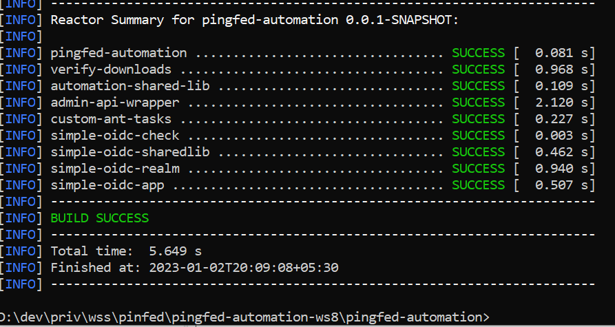
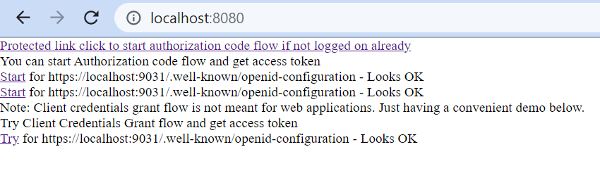

# PingFed Automation Setup steps
## Prerequisites 
- Java JDK 11
- JAVA_HOME environment variable should be correctly setup.
- Java, Maven and Ant should be configured in Path environment variable.
- A running mysql with root user credentials to enable creation of a user,  schema and tables in the mysql for use by pingfederate.
- Ensure ports 9999, 9031, 8080 are available and not in use before proceeding.  

## The steps
Clone the project from - here to a suitable folder in your machine.  
Read pingfed-automation\downloads\downloadnotes.txt.   
Download the files as mentioned here into "pingfed-automation\downloads" folder.  
In command prompt/terminal navigate to pingfed-automation folder.  
Run “mvn clean package” in command prompt.  
  
Wait for it to finish successfully.  
   
In command prompt/terminal navigate to "pingfed-automation/verify-downloads" folder.  
Run "verifydownloads.bat" or "verifydownloads.sh".
I got this output.
  
In command prompt/terminal navigate to 
"pingfed-automation/win/" or "pingfed-automation/linux"  

```diff
! Impotant Note: Before proceeding ensure that mysql is running and reachable.  
! pingfed-automation/mysql.properties file entries should match the expectations.  
+ Edit pingfed-automation\mysql.properties as needed.  
```
  

Run “ant”  
  
Result should look like this:  
   
 
That should setup pinfederate.
#### Start PingDirectory
Run “ant start-ds”  
   
Result should look like this:  
 
Note: Via ant just starting the Ping directory. 
PingDirectory can also be started by launching: start-server.bat or start-server.sh found in bin/bat folder of the Ping Directory.
#### Start Ping Federate
Run “ant start-pingfed”  
   
Result should look like this:  
 
Note: Via ant just starting the Ping Federate. Also capturing the process id.  
Ping Federate can also be started by launching: run.bat or run.sh found in bin folder of the Ping Federate.  
#### Use Ping Federate Admin Console first time
I am using chrome browser. Should possibly work well in other browsers too.  
Visit https://localhost:9999/  
  
You might get a message "Your connection is not private" as shown above.
If so press Advanced button
  
Click on the proceed to localhost link.  
Note: Its possible to configure SSL. Not covering that here.  
We should be seeing this.  
  
Check the checbox and press Next button.  
  
I left the base url at "https://localhost:9031" for now. It can be modified later too. Press Next.  
   
Do nothing. Press Next.   
  
Press the choose file button. Navigate to the ping federate license file in pingfed-automation/downloads.  
Select it.  
  
Press Next.  
   

```diff
! Retain the default. For password I fed "Admin@123" without the quotes.  
+ Ensure this matches with pingfed-automation\admin-api-wrapper\pingfed.api.properties file contents.  
```

Note: Its possible to create additional users for use with pingfed  api.
However keeping it simple.  
Prss Next.  
   
Do nothing. Press Finish.   

   
#### swagger.json
Visit  https://localhost:9999/pf-admin-api/v1/swagger.json
Copy its contents into the file- pingfed-automation\admin-api-wrapper\swagger-json\swagger.json.   
This step has already been done if you are on version pingfederate-11.2.0.  
If your pingfederate version is higher do please update the file content here.  
#### Swagger Code generation
In command prompt/terminal visit folder - "pingfed-automation/admin-api-wrapper".
Run "mvn clean package -P admin".    
  
Result should look like this:   
  
Staying in same location in command prompt Run "java -jar target/admin-api-wrapper.jar admin.Main".  

Visit https://localhost:9999/ and verify the results.  
Lets quickly verify if this was done correctly or not.  
#### Verify the automated configuration
In command prompt or terminal navigate to pingfed-automation\simple-oidc-check folder.  
simple-oidc-check is a maven project. Its also a submodule of pingfed-automation.  
It should be already built.  
Its a simple servlet based project.  
We are going to use this project to verify if we are able to obtain some access tokens from pingfederate.  
In command prompt or terminal after navigating to pingfed-automation\simple-oidc-check folder run "ant".
   
Build should show up like this.  
  
In case of difficulty edit tomcat.ver property in the build.xml file.  
Navigate into build/apache-tomcat-${tomcat.ver}/bin folder and run startup.bat or startup.sh.  
Once this tomcat has started pls visit http://localhost:8080/   
   
In case you see messages of could not connect please ensure pingdirectory and pingfederate is running.    
- **Click on the "Protected..." link**.   
We have two configurations for essentially same oidc server.  
So in next screen it will prompt for selecting the oidc server.    
  
This will start and verify the authorization code flow.  
  
Note: Use "password" for password
Then  
   
Next screen should be this.  
 
Look at the console to see the acces token and other details.  
This above application demonstrates the **authorisation code flow**.  
The improvment areas are :  
1 Caching of jwks and the introspection.  
2 use of refresh token.  

- **Click on the "Try" link**.  
It should take you to another access token via client credentials grant flow.  
If all worked correctly congrats.

#### Stop Ping Federate
Run “ant stop-pingfed”  
   
Result should look like this:  
 
Note: Via ant just stopping the Ping Federate by killing the process.  
Relying on the process id noted earlier.

#### Stop PingDirectory
Run “ant stop-ds”  
   
Result should look like this:  
 
Note: Via ant just stopping the Ping directory. 
PingDirectory can also be stopped by launching: stop-server.bat or stop-server.sh found in bin/bat folder of the Ping Directory.


#### Undo the Setup If and when needed
Run “ant clean”  
 
Result should be like this.  
 
Note: Before running ant clean ensure that pingfederate and pingdirectory are stopped.
Also Note: Can again setup by running "ant".
